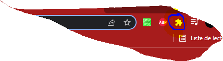
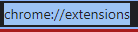
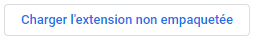

# installation :

1 :

2 :

3 :

4:
mettez le lien ou vous avez télécharger le dossier : https://github.com/alosia-dev/extension/releases/tag/1.0

tuto : 
<iframe width="1237" height="696" src="https://www.youtube.com/embed/YDBJHRtqbFI" title="YouTube video player" frameborder="0" allow="accelerometer; autoplay; clipboard-write; encrypted-media; gyroscope; picture-in-picture" allowfullscreen></iframe>
